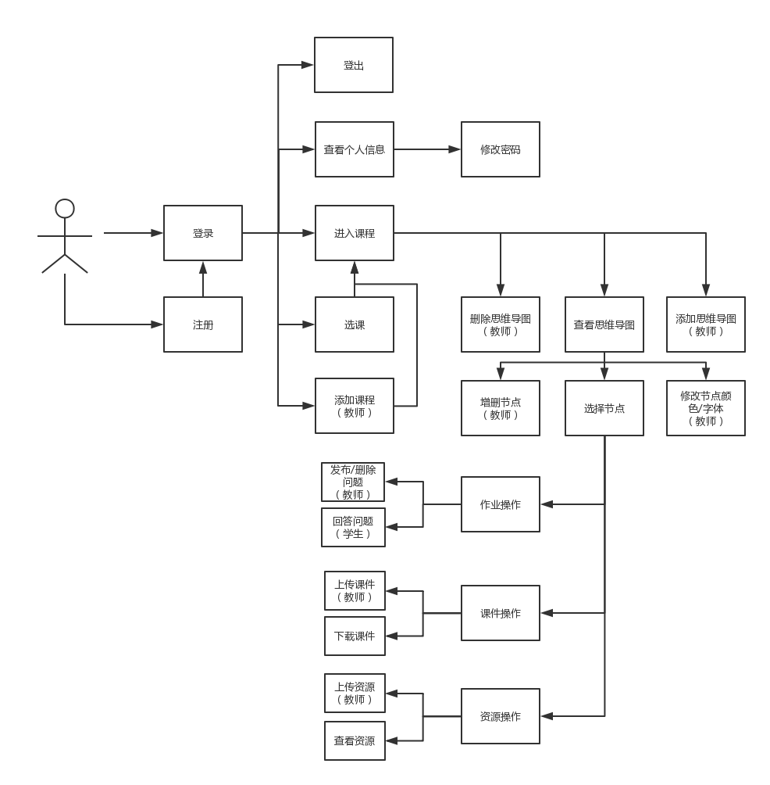
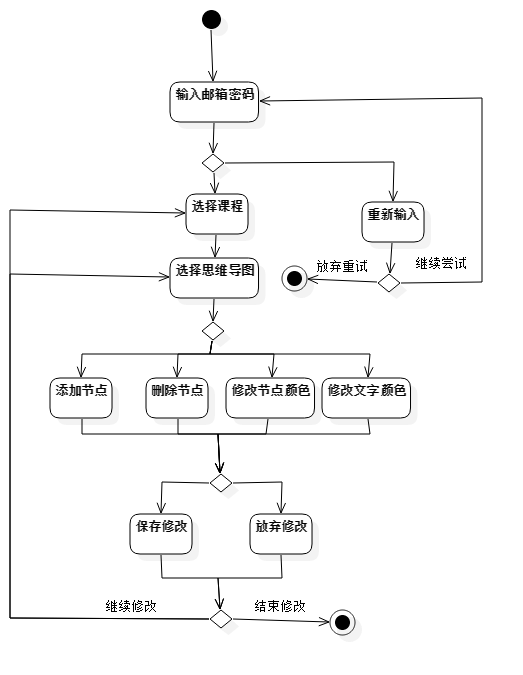
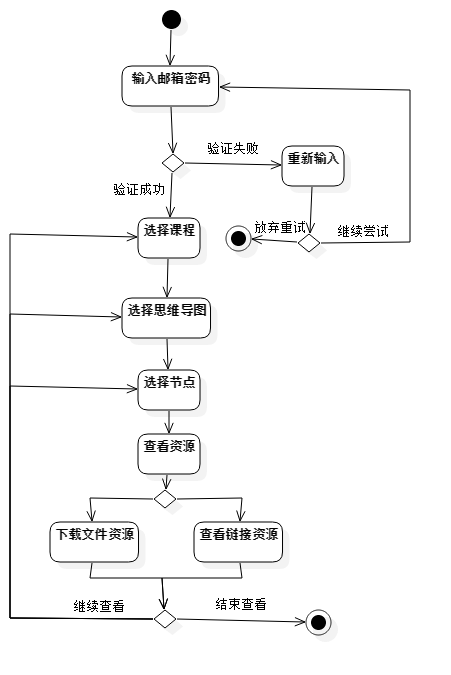
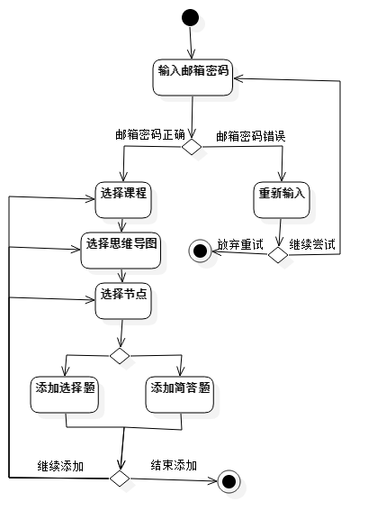
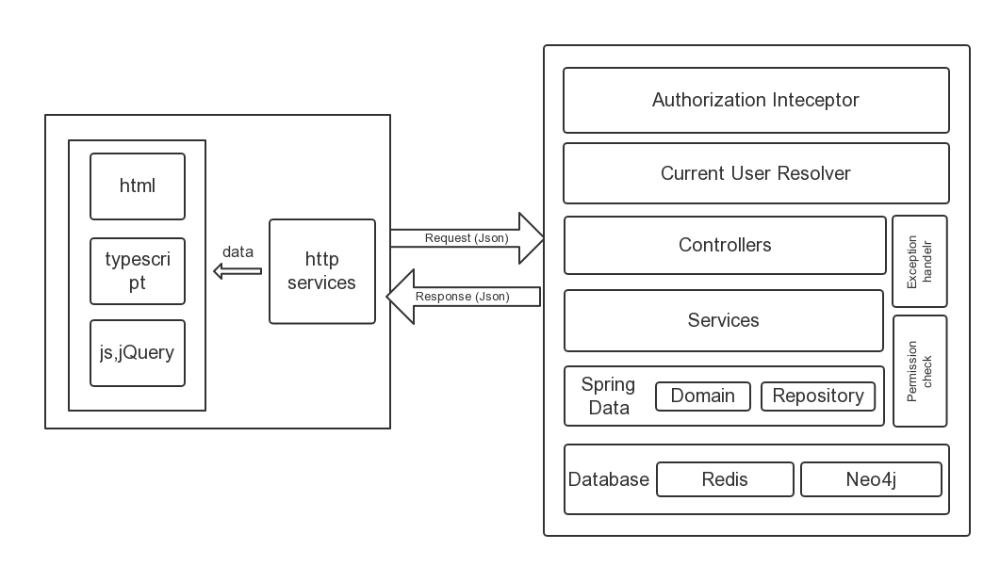
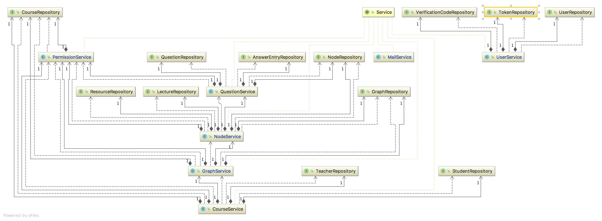

# 高级 Web 文档

## 流程分析

下图给出了用户操作网站的一个完整的流程，图中对于区分用户类型的操作，在流程图中会特别标注出用户的类型。具体的流程如下：

## 功能分析

### 总体功能

该系统的用户为学生和老师。系统提供给用户的功能主要是两个方面：个人信息相关功能（注册，登录等），课程相关功能（查看思维导图，课件，作业等）。对于学生和老师，提供的功能会有所区别，但都覆盖这两个方面。具体的功能可以参考下面的用例图：

### 课程导图相关功能

课程导图是系统提供的主要功能之一。下面给出了用户从登录到查看以及编辑思维导图的一个完成流程：

### 文件资源相关功能

用户在选中课程节点后，可以针对该课程节点的文件资源进行一系列操作。学生可以下课文件资源，而教师可以上传文件资源，下图给出了文件资源相关操作的一个完整流程：

### 作业问题相关功能

学生可以回答课程节点的问题，而教师可以添加问题，下面给出一个问题相关的操作流程：

## 总体架构

### 结构图

后端在接收到前端发送的请求后会首先经过Authrization Inteceptor层，进行权限验证，验证方式是检查Http请求头部的Authorization字段的token数据，通过验证后，进入到Current User Resolver解析层，通过token信息获取对应的用户信息。在经历拦截解析后，后端会根据请求的URL将请求传给对应的controller，controller调用对应service层处理请求；service层通过spring data层与后端数据库进行交互，在对数据进行操作时会对当前用户进行权限检查(Permission check)，如学生不能修改课程数据。Service层在执行过程中如果出现异常，系统会进入Exception Handler，将异常处理的结果返回给前端。

### 类图

controller和service的类图如下：

service 和 repository之间的类关系如下：

### 数据库架构

此次项目我们使用了Neo4j和Redis这两个数据库。其中Neo4j是我们的主力数据库用于网站的数据存储和管理，而Redis数据库主要是用于用户权限验证服务和邮箱验证码服务，关于两个数据库具体的设计可以参见下文数据库设计部分。这里给出我们在使用Neo4j数据库时所设计的ER图。

主要的Entity有user，course， graph，node，question，lecture，resource。其中user分为两种类型，student和teacher，question也分为两种类型short answer question和multiple-choice question。学生和老师和课程的关系分别是learn和teach。一个课程可以和多个graph节点相连，即可以有多张思维导图。graph节点存储了图的基本信息以及思维导图的信息，和一个graph相连接的是思维导图里所有的课程节点node，每一个课程节点都与其课件（lecture），资源（resource），问题（question）节点相连接。

## 前端开发

前端基于Angular 4框架进行开发，使用Bootstrap 4框架进行页面样式设计，jQuery实现动态侧边栏效果

### Angular 4 框架

#### 组件结构设计

header.component

login.component

courselist.component

course.component

​	mindmap.component

​	homework.component

​	lecture.component

​	resource.component

profile.component

register.component

#### 路由配置

- 在Angular中，页面之间的跳转可以使用传统的做法，但使用路由是一个更灵活的做法。
- 路由配置可以单独写成一个Module，在使用到的Module里引入即可（也需要引入Router模块）。
- 路由配置的核心是编写path与component的映射。配置之后，可以通过a标签的“router-link”属性指定跳转的路径，也可以在component里，通过Router模块提供的navigate，redirectTo等方法指定跳转目标，为复杂的跳转条件判断提供了方便的支持。
- 可以方便地匹配错误的路径，为其指定跳转页面。

#### 组件间传值

- 在模板中通过selector引用组件内容时，可以在标签内填写要传递的字段，相应地，在子组件中通过@Input注解接收对应值。这一方式应用在了course组件与其四个子组件之间，子组件根据父组件提供的node id向后端请求数据。
- 通过a标签的router-link在组件间跳转时，可以使用queryParams属性承载要传递的数据，相应地在接收传值的模块里能够通过ActivatedRoute模块提供的routerIonfo.snapshot.queryParams方法得到数据。这一方式应用在courselist组件与course组件之间，后者需要前者提供的course id向后端请求数据。

#### 服务注入

- 能够复用的代码抽取出来封装成service是一个较好的选择，能够降低耦合度。比如项目中的StorageService用于向浏览器的localStorage中读写条目，使用时只需要在组件中注入即可（也可以new一个实例，但是效率不高，不推荐）。
- 对于数据的获取和处理（与后端交互）也应封装成service，比如基于Http模块包装的MyHttpService在每一个请求头部加入用于身份验证的token，同时能够方便地更改后端服务的api请求地址。此外，将每个页面向后端获取数据的操作内聚成一个service（如UserService，CourseService）。

#### 表单实时验证

- 通过双向数据绑定和条件语句结合实现表单的实时验证。
- 在模板中，用[(ngModel)]绑定component中的数据，用*ngIf语句决定满足条件与否时分别要显示的内容。通过这种方式，注册登录的输入框可以做到4实时检测到是否表项是否填写，是否满足填写条件，并给出相应的提示内容。

#### 身份验证

- 登录之后，从后端收到唯一的token，使用StorageService将其储存在浏览器的localStrorage里。
- 每次需要向后端发送请求，MyHttpService会从localStorage中取出token并添加到请求报文的header的Ahthorization字段里。

#### 文件上传下载

- 上传文件使用ng2-file-upload模块
- 下载文件

----待续....

## 后端开发
后端主要使用了 Spring Boot 框架，Neo4j 数据库和 Redis 内存数据库。

### 项目结构说明

### 关键功能实现细节

#### 用户登录状态保存

#### 邮件验证

我们的邮件验证是通过spring-boot-mail服务和redis数据库实现的。spring-boot-mail提供了发送邮件的功能，开发人员只需要在相关配置文件中配置好邮箱的服务器账户和密码，即可使用对应的方法发送邮件。我们的验证流程大致是这样的：后端在接收到发送验证码请求后，会生成一个6位随机数字作为验证码，在进一步处理之前，系统会以用户的注册邮箱为key，将该验证码的值存入redis数据库，并设置过期时间。完成这些操作后，系统调用邮箱服务，将生成的验证码发送给用户。用户将收到的验证码发给后端后，后端会通过用户注册的邮箱在redis数据库找到对应的验证码，比较该验证码和用户发送的验证码是否相同，相同则进行下一步操作，不同则返回给用户验证码错误的提示。用户如果在验证码过期之前多次点击发送验证码，后端会将新生成的验证码覆盖掉旧的验证码，再输入旧的验证码时会提示验证码错误。

#### 权限控制

#### 表单数据验证

### 单元测试

### 数据库设计

#### Neo4j 图数据库
使用 Neo4j 图数据库作为主要的数据库

#### Redis 内存数据库

#### Transation（事务）的使用

## 前后端对接

### REST 接口设计

### ID 设计的考虑

### 跨域访问

此次开发，我们通过三种方式来解决spring boot中出现的跨域访问(Cross Origin)的问题：

1. 使用@CrossOrigin注解；CrossOrigin是spring boot官方提供的用于解决跨域问题的注解。该注解可以添加到controller里的方法上，表示对该方法对应的URL映射提供跨域访问，它也可以添加到controller头部，表示对该controller的所有URL提供跨域访问。

2. 配置Spring config类；添加注解可以解决基本大部分的跨域访问问题，但是在我们测试的过程中发现，有一些访问，即使添加了@CrossOrigin注解，仍会出现跨域访问的问题。在google上搜索了很久也没有找到问题的原因。我们只好尝试别的办法。除了添加CrossOrigin注解，还可以通过配置Spring Config来解决跨域问题。配置的大致过程是创建一个配置类并继承WebMvcConfigurer，重写addCorsMapping方法，添加你想要直接的URL，具体的代码可以参考后端代码中的MvcConfig文件。

3. 在Response头部添加允许跨域访问的字段；在使用了前两种方法后，跨域访问的问题基本没有出现，但是在一次测试的时候，我们在一台电脑上同时运行前端和后端，前端通过"http://localhost:port"这一url访问后端，这个时候又一次的出现了跨域访问的问题，前面的两种方法失效了。为了解决这个问题，我们使用了最为直接也最有效的一种方法，在发送后前端的repsonse头部中添加允许跨域访问的字段。我们在拦截器中，对response头部添加了允许跨域访问的字段，这样做成功的解决了前两种方法没能解决的跨域访问问题，这一部分的具体实现可以参考后端拦截器相关代码。

   

## 部署

### 部署流程

### Neo4j 浏览器访问受限问题的解决

### 邮件服务器垃圾邮件问题的解决

## 项目管理、合作

### GitHub 代码管理

